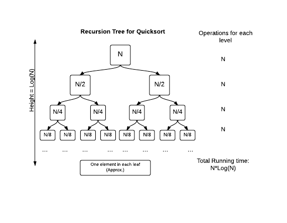

## QuickSort
Like Merge Sort, QuickSort is a Divide and Conquer algorithm. It picks an element as pivot and partitions the given array around the picked pivot. There are many different versions of quickSort that pick pivot in different ways.

* Always pick first element as pivot.
* Always pick last element as pivot.
* Pick a random element as pivot.
* Pick median as pivot.

The key process in QuickSort is partition(). Target of partitions is, given an array and an element x of array as pivot, put x at its correct position in sorted array and put all smaller elements (smaller than x) before x, and put all greater elements (greater than x) after x. All this should be done in linear time.

This is good links to understand how it works. But please, if some of this links contain a solution, avoid them. Try to do it with help.

Quicksort is a recursive method, so we will have to use a technique to calculate the total running time of all the method calls. We can use a version of the "Recursion Tree Method" to estimate the running time for a given array of N element

## Challenges

* Build QuickSort algorithm (pivot - middle element)

* In the Quicksort challenges, you sorted an entire array. Sometimes, you just need specific information about a list of numbers, and doing a full sort would be unnecessary. Can you figure out a way to use your partition code to find the median in an array? Given a list of numbers, can you find the median?

## Resources

* http://me.dt.in.th/page/Quicksort/
* [Link](http://www.sorting-algorithms.com/) which show how different algorithms works.
